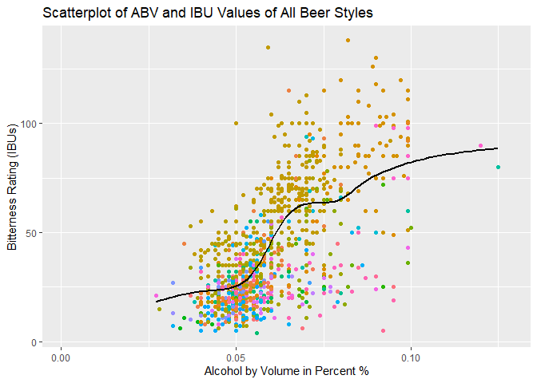
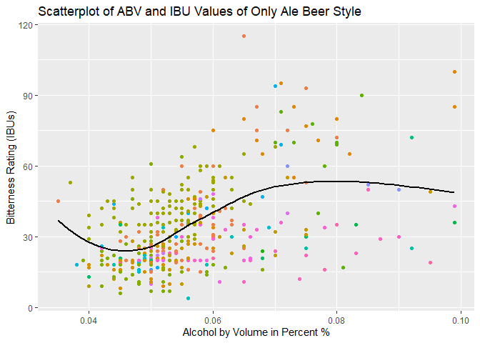

Booze and Brews - Case Study
================
Joey Hernandez and Robert Blue
2022-10-18

## Introduction:

#### Thank you Mr. Smith, and Mr. Jones for the opportunity for us to deliver Beer and Brewery insights so that your company Booze and Brews can align it’s strategic plan for growth, and future offerings so that you can maximize revenues and grow your presence.

#### It was a pleasure working with you and your team, and we hope you are able to gain strong insights from our analysis of the data you provided us.

#### What you will find in this Analysis packet is our step by step process of investigation and analysis into the questions you had regarding the United States Brewery market. Below you will see a list of topics to be covered:

1.  Initialization of Data and software libraries
2.  Data at a glance and Missing Values
3.  Question of Interest 1 - How many Breweries are in each State?
4.  Question of Interest 2 - Describe the Merging of Beer and Breweries
    Data.
5.  Question of Interest 3 - How are the missing values addressed?
6.  Question of Interest 4 - Uncover the Median ABV, and IBU values for
    each State.
7.  Question of Interest 5 - Which State has the Max (highest) ABV
    Value? IBU?
8.  Question of Interest 6 - What are your findings on the statistics
    and distribution of ABV values?
9.  Question of Interest 7 - Is there a relationship between bitterness
    of beer and its alcoholic content?
10. Question of Interest 8 - Investigate the difference with respect to
    IBU and ABV between IPAs and Ales.

## Initialization of Data and Software Libraries:

The first step in our process is to load the data and necessary
libraries so that we can investigate the data with a full assortment of
tools needed to present our findings base on the beer and breweries
data.

``` r
library(tidyverse)
```

    ## ── Attaching packages ─────────────────────────────────────── tidyverse 1.3.2 ──
    ## ✔ ggplot2 3.3.6     ✔ purrr   0.3.4
    ## ✔ tibble  3.1.8     ✔ dplyr   1.0.9
    ## ✔ tidyr   1.2.0     ✔ stringr 1.4.1
    ## ✔ readr   2.1.2     ✔ forcats 0.5.1
    ## ── Conflicts ────────────────────────────────────────── tidyverse_conflicts() ──
    ## ✖ dplyr::filter() masks stats::filter()
    ## ✖ dplyr::lag()    masks stats::lag()

``` r
library(ggplot2)
library(janitor)
```

    ## 
    ## Attaching package: 'janitor'
    ## 
    ## The following objects are masked from 'package:stats':
    ## 
    ##     chisq.test, fisher.test

``` r
library(usmap)
library(caret)
```

    ## Loading required package: lattice
    ## 
    ## Attaching package: 'caret'
    ## 
    ## The following object is masked from 'package:purrr':
    ## 
    ##     lift

``` r
library(e1071)
library(class)
library(knitr)
library(ggthemes)
beer_data <-read.csv("C:/Users/Joey/Desktop/DDS_Work/Unit - 8/Beers.csv")
brew_data <- read.csv("C:/Users/Joey/Desktop/DDS_Work/Unit - 8/Breweries.csv")
```

## Data at a glance & Missing Vaules:

#### During our initial consultation, you mentioned the data could contain some missing values as well as some potential errors. In order for us to present the most accurate findings, we took a series of steps to ensure that any errors or missing values were either addressed or corrected.

1.  Identify the rows and columns of the data sets. This first glance
    allows us to understand what type of variables and variable types we
    are working with, additionally, we are able to understand the size
    of data that we have.

2.  Viewing the data sets allowed us to identify similar columns within
    the 2 groups that we could use to merge the data. Merging the data
    together allows us to create a data frame that contains all we need
    in one location. We will not yet merge the data within this step but
    we do take action and rename any columns that may be of interest.
    What you will find if you look at the data is that we changed both
    data brewery identification columns to the title ‘Brewery_id’ so
    that we could merge the data with this as our bridge variable.

3.  Before merging the data together we checked each dataset
    individually for missing values and broke them into explicit and
    implicit missing values.

4.  We addressed Explicit Values (NAs) by investigating why there may
    have been explicitly missing values in the data. Upon further
    investigation we discovered that certain values are not always
    reported (or are required to be reported) by breweries. This varies
    from brewery to brewery but most often has to do with state and
    other governing matters. In the case of missing IBU values this also
    varies from location to location and can be attributed to different
    crafting methods in addition to simply not being required to report.
    We did not completely leave out this data, but instead left it as NA
    when applicable since it represented such a high amount of data.

5.  The data did contain some Implicit values in the form of missing
    data. Upon further investigation we were able to either remedy the
    missing values by researching the product in question, or gain an
    understanding of why a value may not have been present so that we
    could understand how it would impact the remaining data (or if it
    impacted the remaining data).

6.  There was instances of duplicate data which were attributed to
    incorrect brewery locations, or were attributed to repeated batches
    of an offering as well as different sizes of certain drinks. The
    remedy was addressed on a case by case basis, but in short the only
    data removed was data that was incorrect, such as the duplicate
    locations entered by spelling, or typo errors.

7.  While not a big issue, the state abbreviations all contained some
    white space before the actual character of the string. This white
    space was removed to better utilize the variable.

8.  Finally after all found errors were addressed, we merged the data
    into one piece.

``` r
#################### Exploring Raw Data ###########################
# check rows and columns
# head(beer_data)
# head(brew_data)

# rename columns for merging 
names(beer_data)[1] <- 'beer_name'
names(brew_data)[2] <- 'Brew_name'
names(brew_data)[1]<- 'Brewery_id'


# checking for missing values beer 
# sapply(beer_data,function(x) sum(is.na(x))/nrow(beer_data))
# sapply(beer_data,function(x) sum(x== ""))

# checking for missing values brew
# sapply(brew_data,function(x) sum(is.na(x))/nrow(brew_data))
# sapply(brew_data,function(x) sum(x== ""))

# addressing the missing values from beer
beer_data[854,'Style'] = "Scottish Ale"
beer_data[867, 'Style'] = 'Marzen'


# looking for duplicates in data 
# brew_data %>% get_dupes(Brewery_id)
# brew_data %>% get_dupes(Brew_name)
# beer_data %>% get_dupes(beer_name)
# beer_data %>% get_dupes(Brewery_id)
# beer_data %>% get_dupes(Beer_ID)

# addresses the duplicates in brew_data 
brew_data<- brew_data[-c(96,378,262,139),] 

# addresses the duplicates in beer_data
beer <- beer_data[!duplicated(beer_data$beer_name),]
# beer %>% get_dupes(Brewery_id) # these duplicates are for various drinks from the same brew id
# beer %>% get_dupes(Beer_ID) # fixed
# beer %>% get_dupes(beer_name)

# gets rid of the white space before the State abb. 
brew_data$State<-trimws(brew_data$State, "left")


# merging beer and brew_data - with an inner join
beer_brew <- merge(brew_data, beer, by ='Brewery_id')
```

## Question of Interest 1:

#### How many breweries are in each state?

In order to represent and visually display this data, we first had to
ensure that any duplicated values that would throw off the count for
each state were handled. Next we grouped the variables of the data into
a filtered set that we could call on to create our plot, and finally we
plotted a map of the United States the Numerical brewery representation
over each state. This type of plot intuitively shows where and how the
brewery locations are distributed across the United States. Below you
will find this breakdown visual as well as a table of the result for a
list of comparisons.

``` r
################################### Question 1 ##################################

# this gets only one brewery name so that we don't have multiple brew representation because 
# of the multiple drinks served by that one location. 
state_num_data <- beer_brew[!duplicated(beer_brew$Brew_name),]

# the n_distinct takes care of the potential repeat brew representation making last line redundant
# but kept in as precautionary measure.
state_brew_plot <- state_num_data %>% group_by(State) %>%
  summarise(num_brew = n_distinct(Brew_name),
  mean_abv = mean(ABV), mean_ibu = mean(IBU)) %>%
  arrange(desc(num_brew))

# changes column State to state to satisfy the usmap argument
names(state_brew_plot)[1] <- 'state'

# makes into dataframe
state_brew_plot <- as.data.frame(state_brew_plot)

# plot of the Concentration of Breweries in the US
plot_usmap(data=state_brew_plot[,1:2],
           regions = "states",
           labels = TRUE,label_color = "black",
           values = "num_brew") +
          scale_fill_gradient(low = 'white', high = 'red')+
          labs(title = 'Distribution of Breweries Across The United States',
               fill = "Brewery \nAmount") +
          theme(legend.position = "right") 
```

<!-- -->

``` r
# SECONDARY MAP TO DISPLAY ACTUAL REPRESENTAION OF NUMERICAL VALUE PER EACH STATE 
# get centroids 
centroid_labels <- usmapdata::centroid_labels("states")

names(centroid_labels)[4] <- 'state'

# join data to centroids (using lat/long as coord. for state centers on map plot)
data_labels <- merge(centroid_labels, state_brew_plot, by = "state")

# create US map with centroids and lat/long as the label
brews_per_state <- plot_usmap(data = state_brew_plot[,1:2],
                              values = "num_brew",
                              color = "black",
                              labels = F) +
  guides(fill = "none") +
  geom_text(data = data_labels,aes(x = x, y = y,
                                   label = scales::number(num_brew, accuracy = 1)),color = "black")+ 
  scale_fill_gradient(low = "white", high = "red") +
  labs(title = "Distribution of Breweries Across The United States",
       fill = "Brewery \nAmount") +
  theme(legend.position = "right")

brews_per_state
```

<!-- -->

##### Please note that the table below contain a NaN value. This is because SD (South Dakota) only contains data for 1 brewery which did not report their IBU. When the data was filtered to remove Non-Value IBU data it kept SD because it still must be represented in this table to illustrate the Number of Breweries in each State.

``` r
# table for display in RMD file
kable(state_num_data %>% group_by(State) %>%
summarise(Num_Brew = n_distinct(Brew_name),
          Mean_ABV = mean(na.omit(ABV)), Mean_IBU = mean(na.omit(IBU))) %>%
arrange(desc(Num_Brew)))
```

| State | Num_Brew |  Mean_ABV | Mean_IBU |
|:------|---------:|----------:|---------:|
| CO    |       46 | 0.0617333 | 41.82759 |
| CA    |       39 | 0.0599231 | 42.71429 |
| MI    |       32 | 0.0571290 | 21.77778 |
| OR    |       29 | 0.0568276 | 46.65000 |
| TX    |       28 | 0.0586667 | 46.00000 |
| PA    |       24 | 0.0597619 | 50.12500 |
| WA    |       23 | 0.0584348 | 44.64286 |
| IN    |       22 | 0.0608182 | 47.38462 |
| MA    |       22 | 0.0575455 | 38.10000 |
| NC    |       19 | 0.0574444 | 46.80000 |
| WI    |       19 | 0.0522632 | 31.85714 |
| IL    |       18 | 0.0581111 | 43.20000 |
| NY    |       16 | 0.0528667 | 37.54545 |
| FL    |       15 | 0.0569286 | 43.50000 |
| OH    |       15 | 0.0661333 | 51.37500 |
| VA    |       15 | 0.0593333 | 53.84615 |
| AZ    |       11 | 0.0605000 | 35.40000 |
| MN    |       11 | 0.0630909 | 60.25000 |
| ME    |        9 | 0.0570000 | 66.25000 |
| MO    |        9 | 0.0605556 | 48.20000 |
| MT    |        9 | 0.0555000 | 48.75000 |
| VT    |        9 | 0.0563333 | 32.60000 |
| AK    |        7 | 0.0522857 | 36.60000 |
| CT    |        7 | 0.0581429 | 51.50000 |
| GA    |        7 | 0.0532857 | 38.00000 |
| MD    |        7 | 0.0578571 | 52.50000 |
| OK    |        6 | 0.0580000 | 20.00000 |
| IA    |        5 | 0.0574000 | 39.33333 |
| ID    |        5 | 0.0636000 | 38.75000 |
| LA    |        5 | 0.0580000 | 34.33333 |
| NE    |        5 | 0.0663333 | 11.00000 |
| RI    |        5 | 0.0542000 | 23.00000 |
| HI    |        4 | 0.0505000 | 22.50000 |
| KY    |        4 | 0.0652500 | 44.50000 |
| NM    |        4 | 0.0617500 | 15.00000 |
| SC    |        4 | 0.0615000 | 17.50000 |
| UT    |        4 | 0.0475000 | 34.00000 |
| WY    |        4 | 0.0572500 | 16.33333 |
| AL    |        3 | 0.0626667 | 53.00000 |
| KS    |        3 | 0.0483333 | 28.66667 |
| NH    |        3 | 0.0460000 | 15.00000 |
| NJ    |        3 | 0.0510000 | 43.33333 |
| TN    |        3 | 0.0500000 | 30.66667 |
| AR    |        2 | 0.0485000 | 39.00000 |
| DE    |        2 | 0.0550000 | 52.00000 |
| MS    |        2 | 0.0575000 | 41.50000 |
| NV    |        2 | 0.0500000 | 50.00000 |
| DC    |        1 | 0.0500000 | 15.00000 |
| ND    |        1 | 0.0500000 | 32.00000 |
| SD    |        1 | 0.0550000 |      NaN |
| WV    |        1 | 0.0670000 | 71.00000 |

## Question of Interest 2:

#### Describe the Beer and Breweries Data Merging

Although the analysis of our data may use filtered version of the merged
data set, below you will see a snippet of the beginning and ending our
or merged data set.

``` r
head(beer_brew)
```

      Brewery_id          Brew_name        City State     beer_name Beer_ID   ABV
    1          1 NorthGate Brewing  Minneapolis    MN Maggie's Leap    2691 0.049
    2          1 NorthGate Brewing  Minneapolis    MN    Wall's End    2690 0.048
    3          1 NorthGate Brewing  Minneapolis    MN       Pumpion    2689 0.060
    4          1 NorthGate Brewing  Minneapolis    MN   Parapet ESB    2687 0.056
    5          1 NorthGate Brewing  Minneapolis    MN  Get Together    2692 0.045
    6          1 NorthGate Brewing  Minneapolis    MN    Stronghold    2688 0.060
      IBU                               Style Ounces
    1  26                  Milk / Sweet Stout     16
    2  19                   English Brown Ale     16
    3  38                         Pumpkin Ale     16
    4  47 Extra Special / Strong Bitter (ESB)     16
    5  50                        American IPA     16
    6  25                     American Porter     16

``` r
tail(beer_brew)
```

         Brewery_id                     Brew_name          City State
    2296        556         Ukiah Brewing Company         Ukiah    CA
    2297        557       Butternuts Beer and Ale Garrattsville    NY
    2298        557       Butternuts Beer and Ale Garrattsville    NY
    2299        557       Butternuts Beer and Ale Garrattsville    NY
    2300        557       Butternuts Beer and Ale Garrattsville    NY
    2301        558 Sleeping Lady Brewing Company     Anchorage    AK
                         beer_name Beer_ID   ABV IBU                   Style Ounces
    2296             Pilsner Ukiah      98 0.055  NA         German Pilsener     12
    2297           Snapperhead IPA      51 0.068  NA            American IPA     12
    2298         Porkslap Pale Ale      49 0.043  NA American Pale Ale (APA)     12
    2299  Heinnieweisse Weissebier      52 0.049  NA              Hefeweizen     12
    2300         Moo Thunder Stout      50 0.049  NA      Milk / Sweet Stout     12
    2301 Urban Wilderness Pale Ale      30 0.049  NA        English Pale Ale     12

## Question of interest 3:

#### Address The Missing Values

Upon working with the data we found a number of missing values. While we
were able to remedy most of the issues found, the ones mentioned below
are data that either were not relevant to the data set, or were left out
because of different reporting mechanisms or the absence of a
requirement to report.

-   CAN’d Aid: Oskar Blues Brewery teamed up with CAN’d Aid Foundation
    to fill cans of drinking water for residents in Southeast Texas. The
    missing value can be attributed to this item not having a style of
    alcohol since it is water which is not a form of alcohol.

-   Crowler: CROWLER (CAN + growler) is a 32-ounce or 25-ounce CAN
    filled with fresh craft beer from the draft source. The missing
    values here are attributed to this not being an actual drink.

-   Special Release: This beer was shown through various searches to be
    a retired drink. Because of it’s retired status there didn’t seem to
    be any information of relevance.

-   IBU & ABV (Explicit Values): The IBU and ABV columns list almost
    half of their values as “NA”. It would be unwise to remove this data
    since it would misrepresent the presence of breweries and their
    offerings. Imputing the values of this data was under consideration
    but given that the variability of the values differs on markets,
    breweries, and crafting styles it did not seem like an effective
    method for resolving these missing values.

## Question of Interest 4:

#### Investigate the Median Value of Alcohol Content and International Bitterness Unit for each state.

The median values of Alcohol content and International Bitterness Units
are displayed in the tables below. It is worth mentioning that the
missing ABV and IBU values effect the presence of breweries on the map.
This change in visualization is due to the missing values not being
included in the median calculations which effects the representation of
that data on the map. A specific example of this would be the removal
(grayed out portion) of South Dakota when visualizing the results for
the median IBU.

``` r
################################### Question 4 ##################################

# this will return medians for each state ( NA NOT INCLUDED )
state_medians <- beer_brew %>% group_by(State) %>%
  summarise(num_brew = n_distinct(Brew_name),
            median_abv = median(ABV, na.rm = TRUE), median_ibu = median(IBU, na.rm = TRUE)) %>%
  arrange(desc(num_brew))

# to return the medians data
# state_medians

# convert to data frame
state_medians <- as.data.frame(state_medians)

# convert variable column from S to s (upper to lower) so that it works with data in next question
names(state_medians)[1] <- 'state'

# plot Median ABV
state_medians %>% ggplot(aes(x = reorder(state, desc(median_abv)), y = median_abv*100, fill = state))+
  geom_bar(stat='identity', show.legend = FALSE)+
  coord_flip() +
  ggtitle("Bar Plot of Median Alcohol by Volume (ABV) Values for Each State") +
  xlab("State by Abbreviation")+
  ylab("Median Value of Alcohol by Volume in Percent")
```

<!-- -->

``` r
# plot Median IBU
state_medians %>% ggplot(aes(x = reorder(state, desc(median_ibu)), y = median_ibu, fill = state))+
  geom_bar(stat = 'identity', show.legend = FALSE) +
  coord_flip() +
  ggtitle("Bar plot of Median IBU Values for Each State")+
  xlab("State by Abbreviation")+
  ylab("Median International Bitterness Units (IBU)")
```

<!-- -->

``` r
# creating a variable to call for median labels
median_labels <- merge(centroid_labels, state_medians, by ='state')

# create the ABV map
abv_state_plot <- plot_usmap(data = state_medians[,1:3],
                             values = "median_abv",
                             color = "black",
                             labels = F) +
  guides(fill = "none") +
  geom_text(data = median_labels, aes(
    x = x, y = y,
    label = scales::number(median_abv * 100, accuracy = 0.01)), color = "black") +
  scale_fill_gradient(low = "white", high = "red") +
  labs(title = "Distribution of Median ABV for Each State")

# create the IBU map
ibu_state_plot <- plot_usmap(data = state_medians[,1:4],
                             values = "median_ibu",
                             color = "black",
                             labels = F)+
  guides(fill = "none")+
  geom_text(data = median_labels, aes(
    x = x, y = y,
    label = scales::number(median_ibu, accuracy = 1)), color = "black") +
  scale_fill_gradient(low = "white", high = "red")+
  labs(title = "Distribution of Median IBU for Each State")

# plot the ABV Median state plot
abv_state_plot
```

<!-- -->

``` r
# plot the IBU Median state plot
ibu_state_plot
```

<!-- -->

## Question of Interest 5:

#### Determine Which States Contain the Highest Value of Alcohol by Volume (ABV) and International Bitterness Units (IBU).

The State with the highest Alcohol by Volume is Colorado (CO) at 12.8%.
This was determined by selecting only the State and IBU columns then
running a function which would interpret the Max value.

The State with the highest International Bitterness Unit is Oregon (OR)
at 138 IBUs. This value was determined by selecting only the State and
IBU columns then running a function which would interpret the Max value.

``` r
################################### Question 5 ##################################

# to call on selected data that will only return the sought after information
max_abv <- beer_brew %>% select(ABV, State)

max_abv[which.max(max_abv$ABV),]
```

          ABV State
    369 0.128    CO

``` r
# mean(max_abv$ABV, na.rm = TRUE) * 100 # 5.99 %
# median(max_abv$ABV, na.rm = TRUE) * 100 # 5.7 %
# plot for IBU
max_ibu <- beer_brew %>% select(IBU, State)

max_ibu[which.max(max_ibu$IBU),]
```

         IBU State
    1771 138    OR

``` r
# mean(max_ibu$IBU, na.rm = TRUE) # 42.955
# median(max_ibu$IBU, na.rm = TRUE) # 35
```

## Question of Interest 6:

#### Comment on the Summary Statistics & Distribution of The Alcohol by Volume (ABV) Variable

The Distribution of Alcohol by Volume across the United States appears
to have a right skew to the data. This right skew can be interpreted as
a distribution of data in which there tends to be a higher instance of
larger values to the right of the median in the data, as opposed to an
equal portion of large and small values to the right and left of the
mean. A visual representation of this can be viewed below.

``` r
################################### Question 6 ##################################

abv_dis_plot <- beer_brew %>% select(ABV,Brewery_id)
abv_dis_plot %>% ggplot(aes(ABV * 100)) +
  geom_histogram(color = 'black',aes(fill = 'red'), binwidth = .25, alpha = .5, show.legend = FALSE) +
  ggtitle('Distribution of the Alcohol by Volume Content in Beer From Various Breweries')+
  ylab('Frequency') + xlab('Alcohol by Volume in Percent %')
```

<!-- -->

``` r
summary(beer_brew$ABV * 100)
```

       Min. 1st Qu.  Median    Mean 3rd Qu.    Max.    NA's 
      0.100   5.000   5.700   5.993   6.800  12.800      60 

## Question of Interest 7:

#### Is there an apparent relationship between the bitterness of the beer and its alcoholic content?

It appears that there is a positive relationship between the bitterness
of beer and its alcoholic content. We can visualize on a scatter plot
that as the bitterness rating increases there tends to be an increase in
Alcohol by Volume Percentage (ABV).

We created a series of scatter plots that would help clean up the
visualization of the relationship between IBU and ABV as they relate to
different styles. These plots are below:

### 1. First this plot shows us the general relationship with all styles included.

``` r
################################### Question 7 ##################################

ibu_abv_plot <- beer_brew %>% select(IBU,ABV,Style)
             
ibu_abv_plot %>% ggplot(aes(x = ABV, y = IBU)) + 
  geom_point(aes(color = Style), show.legend = FALSE) + 
  geom_smooth(se = FALSE, color = "black") +
  ggtitle("Scatterplot of ABV and IBU Values of All Beer Styles") +
  xlab("Alcohol by Volume in Percent %") +
  ylab("Bitterness Rating (IBUs)")
```

    ## `geom_smooth()` using method = 'gam' and formula 'y ~ s(x, bs = "cs")'

<!-- -->

### 2. This visualization is the same but filtered for only IPA beverages.

``` r
# visualizing scatter plot of ABV and IBU with Style filter for all IPA 
ipa_viz <- ibu_abv_plot %>% filter(str_detect(Style, 'IPA'))

ipa_viz %>% ggplot(aes(x = ABV, y = IBU)) +
  geom_point(aes(color = Style))+
  geom_smooth(se = FALSE, color = 'black') +
  ggtitle("Scatterplot of ABV and IBU Values of Only IPA Beer Style") +
  xlab("Alcohol by Volume in Percent %") +
  ylab("Bitterness Rating (IBUs)")
```

    ## `geom_smooth()` using method = 'loess' and formula 'y ~ x'

<!-- -->

### 3. Below you will see a scatter plot filtered to visualize the same ABV, IBU relationship with only Ale beverages.

``` r
# visualizing scatter plot of ABV and IBU with Style filter for all ALE
ale_viz <- ibu_abv_plot %>% filter(str_detect(Style, "Ale"))

ale_viz %>% ggplot(aes(x = ABV, y = IBU)) +
  geom_point(aes( color = Style), show.legend = FALSE) +
  geom_smooth(se = FALSE, color = 'black') +
  ggtitle("Scatterplot of ABV and IBU Values of Only Ale Beer Style") +
  xlab("Alcohol by Volume in Percent %") +
  ylab("Bitterness Rating (IBUs)")
```

    ## `geom_smooth()` using method = 'loess' and formula 'y ~ x'

<!-- -->

### 4. Finally this scatter plot displays the ABV, IBU relationship with styles filterd to include every type that is NOT IPA, or Ale.

``` r
# visualizing scatter plot of ABV and IBU with style filter for not ALE, or IPA
else_viz <- ibu_abv_plot %>% filter(!str_detect(Style, "Ale")) %>% filter(!str_detect(Style, "IPA"))

else_viz %>% ggplot(aes(x = ABV * 100, y = IBU)) +
  geom_point(aes(color = Style), show.legend = FALSE) +
  geom_smooth(se = FALSE, color = "black") + 
  ggtitle("Scatterplot of ABV and IBU Values of Beer Styles Other Than Ale, or IPA") + xlab("Alcohol by Volume in Percent %")+ylab("Bitterness Rating (IBUs)")
```

    ## `geom_smooth()` using method = 'loess' and formula 'y ~ x'

<!-- -->

#### It appears that across most styles of beer there is a positive relationship between IBU and ABV. It is worth discussing however the “Ale” style of beer has somewhat of a curved arguably non-linear relationship. The majority of values in which ABV is greater than 6% appear to be of an equal distribution about the y-axis, and lose their visual power to explain the variance of IBU ratings.

## Question of Interest 8:

#### Investigate the difference with respect to IBU and ABV between IPAs and other types of Ale.

We found with our model that it is possible to predict whether a beer is
considered an IPA or Ale based on its IBU and ABV values at an Accuracy
of 84.64%. The model created to do this is a KNN model which uses
neighboring values of a “k” amount around the given input to predict
what the classification of the item in question is. Additionally, we
created a model to generate the optimal K value so that we could fine
tune the parameter to generate accurate results.

``` r
################################### KNN Prediction Model Data #########################

# test to see how the model will work using beer_brew

# make a Dataframe without NA so that we can run KNN:
beer_predict <- na.omit(beer_brew)
# sanity check 
#view(beer_predict)

# creating a data frame that can be used to minimize the noise between Ale and IPA
ipa_knn <- beer_predict %>% select(Brewery_id,beer_name, IBU, ABV, Style) %>%
  group_by(Brewery_id) %>% filter(str_detect(Style, "IPA")) %>%
  mutate(Style = "ipa")

ale_knn <- beer_predict %>% select(Brewery_id,beer_name, IBU, ABV, Style) %>%
  group_by(Brewery_id) %>% filter(str_detect(Style, "Ale")) %>% 
  mutate(Style = "ale")

# view(ipa_knn)  # 374
# view(ale_knn) # 519

combine_knn <- full_join(ipa_knn, ale_knn)
```

    ## Joining, by = c("Brewery_id", "beer_name", "IBU", "ABV", "Style")

``` r
# view(combine_knn)

# simple test to see if the data works together within the KNN function
# my_beer_test <- data.frame(IBU = c(.05, .04, .043), ABV = c(.06, .055, .065))
# knn(beer_predict[,c(7,8)], my_beer_test, beer_predict$Style, k = 3, prob = TRUE)


# viewing what matches each of these strings will return before filtering. 
# (str_view_all(beer_predict$Style, 'Ale', match = TRUE))
# (str_view_all(beer_predict$Style, 'IPA', match = TRUE))

# creating test variable to call so we can see if the filter works
#test_ale_filter <- beer_predict %>% filter(str_detect(Style, 'Ale'))
#view(test_ale_filter$Style) # viewing the filter for effectiveness

# repeating the same process for the IPA
#test_ipa_filter <- beer_predict %>% filter(str_detect(Style, 'IPA'))
#view(test_ipa_filter$Style) # viewing the filter for effectiveness 

# using both filters above to create one combo test filter
#test_combo_filter<- beer_predict %>% filter(str_detect(Style, 'IPA') | str_detect(Style, "Ale"))
#view(test_combo_filter$Style)


# creating the finalized data frame to use for test/train split etc. 
# beer_predict_fin <- beer_predict %>% filter(str_detect(Style, 'IPA') | str_detect(Style, "Ale"))
# glimpse(beer_predict_fin)
```

``` r
################################### KNN Test type 2 #########################

#checking dimensions to understand what our test/train will look like
# glimpse(beer_predict_fin)
# nrow(combine_knn) # total 893 rows
# round(nrow(combine_knn)*.3) # total 268


set.seed(765)
intrain <- sample(nrow(combine_knn), round(nrow(combine_knn)*.30))
beer_train <- combine_knn[intrain,]
beer_test <- combine_knn[-intrain,]


# setting up the classification 
classification <- knn(beer_train[,c(3,4)],
                      beer_test[,c(3,4)],
                      beer_train$Style,
                      k = 3, prob = TRUE)

# setting up a passable data for confusion matrix 
u <- union(classification, beer_test$Style)
t <- table(factor(classification, u), factor(beer_test$Style, u), dnn = c("Prediction", "Truth"))

# confusion matrix for more stats on the model
CM <- confusionMatrix(t)

beer_knn_plot <- as.data.frame(CM$table)

beer_knn_plot$Prediction <- factor(beer_knn_plot$Prediction, levels = rev(levels(beer_knn_plot$Truth)))

ggplot(beer_knn_plot, aes(Prediction, Truth, fill = (Freq))) +
  geom_tile(show.legend = FALSE) + geom_text(aes(label = (Freq))) +
  scale_fill_gradient(low = "light blue", high = "#009194") +
  labs(x = "Truth", y = "Prediction") +
  scale_x_discrete(labels = c("IPA", "Ale")) +
  scale_y_discrete(labels = c("Ale", "IPA"))+
  coord_flip()+
  ggtitle("Confusion Matrix Categorizing Model Predictions Against Actual Values")
```

<!-- -->

``` r
cat('Accuracy:',CM$overall[1]*100,"%",
    "\nSensitivity:",CM$byClass[1]*100, "%",
    "\nSpecificity:",CM$byClass[2]*100, "%")
```

    Accuracy: 84.64 % 
    Sensitivity: 90.16393 % 
    Specificity: 76.83398 %

#### Key model Statistics:

Accuracy 84.64% - Overall Accuracy of the classifier.

Sensitivity: 90.16% - (true positive rate) refers to the probability of
a positive test, conditioned on truly being positive.

Specificity: 76.83% - (true negative rate) refers to the probability of
a negative test, conditioned on truly being negative.

``` r
################################### KNN finding best K #########################

iterations = 50
num_of_k = 50
split_percent = .3

model_accuracy = matrix(nrow = iterations, ncol = num_of_k)
model_specificity = matrix(nrow = iterations, ncol = num_of_k)
model_sensitivity = matrix(nrow = iterations, ncol = num_of_k)

for (j in 1:iterations)
{
  set.seed(765)
  intrain2 <- sample(nrow(combine_knn), round(nrow(combine_knn)*split_percent))
  train2 <- combine_knn[intrain2,]
  test2 <- combine_knn[-intrain2,]
  for(i in 1:num_of_k)
  {
    classify = knn(train2[,c(3,4)],
                   test2[,c(3,4)],
                   train2$Style,
                   k = i, prob = TRUE)
    u = union(classify, test2$Style)
    t = table(factor(classify, u), factor(test2$Style, u))
    CM = confusionMatrix(t)
    model_accuracy[j,i] = CM$overall[1]
    model_specificity[j,i] = CM$byClass[1]
    model_sensitivity[j,i] = CM$byClass[2]
  }
  
  
}

mean_accuracy = colMeans(model_accuracy)
# to determine which level of k provided the best accuracy so that we can tune the model if needed
# which.max(mean_accuracy)
mean_specificity = colMeans(model_specificity)
mean_sensitivity = colMeans(model_sensitivity)

plot(seq(1,num_of_k,1),
     mean_accuracy, type = "l",
     xlab = "Kth value 1:50",
     ylab = "Mean value of measured Accuracy")
```

<!-- -->

``` r
plot(seq(1, num_of_k, 1),
     mean_specificity,
     type = 'l',
     xlab = "Kth value 1:50",
     ylab = "Mean value of measured Specificity")
```

<!-- -->

``` r
plot(seq(1, num_of_k, 1),
     mean_sensitivity, type = 'l',
     xlab = "Kth value 1:50",
     ylab = "Mean value of measured Sensitivity")
```

<!-- -->

## Conclusion:

##### The purpose of our research was to investigate the Beer and Brewery data provided by Booze and Brews, and subsequenlty provide the following insights:

1.  The top 5 States with the most Breweries are CO (46), CA (39),
    MI(32), OR(29), and TX(28).

2.  Missing values within IBU and ABV are likely due to reporting
    discrepancies between brewery to brewery, or state to state (legal
    reporting requirement) this data can serve to be helpful in gaining
    important insight for various markets so we suggest that efforts are
    applied when able to obtain this information.

3.  The State with the highest Median value for IBU is Maine (ME). The
    State with the highest Median value for ABV is Washington (DC).

4.  The State with the highest value of ABV is Colorado (CO). The State
    with the highest value of IBU is Oregon (OR).

5.  The Distribution of Alcohol by Volume across the United States
    appears to have a right skew to the data. This right skew can be
    interpreted as a distribution of data in which there tends to be a
    higher instance of larger values to the right of the median in the
    data, as opposed to an equal portion of large and small values to
    the right and left of the mean. A visual representation of this can
    be viewed below.

6.  Overall It appears that there is a positive relationship between the
    bitterness of beer and its alcoholic content. We can visualize on a
    scatter plot that as the bitterness rating increases there tends to
    be an increase in Alcohol by Volume Percentage (ABV). When we dive
    deeper into the data and visualize different plots of data It
    appears that across most styles of beer there is a positive
    relationship between IBU and ABV. It is worth discussing however the
    “Ale” style of beer has somewhat of a curved arguably non-linear
    relationship. The majority of values in which ABV is greater than 6%
    appear to be of an equal distribution about the y-axis, and lose
    their visual power to explain the variance of IBU ratings.

7.  We found with our model that it is possible to predict whether a
    beer is considered an IPA or Ale based on its IBU and ABV values at
    an Accuracy of 84.64%. The model created to do this is a KNN model
    which uses neighboring values of a “k” amount around the given input
    to predict what the classification of the item in question is.
    Additionally, we created a model to generate the optimal K value so
    that we could fine tune the parameter to generate accurate results.
